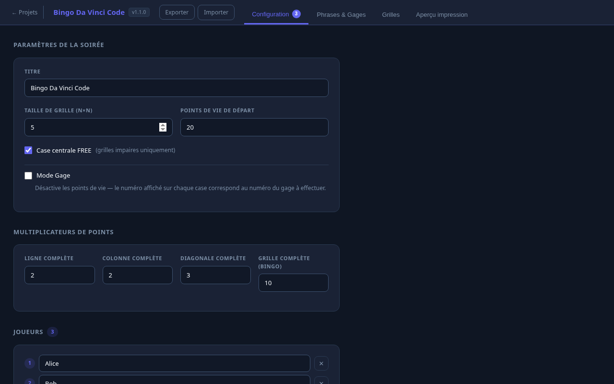
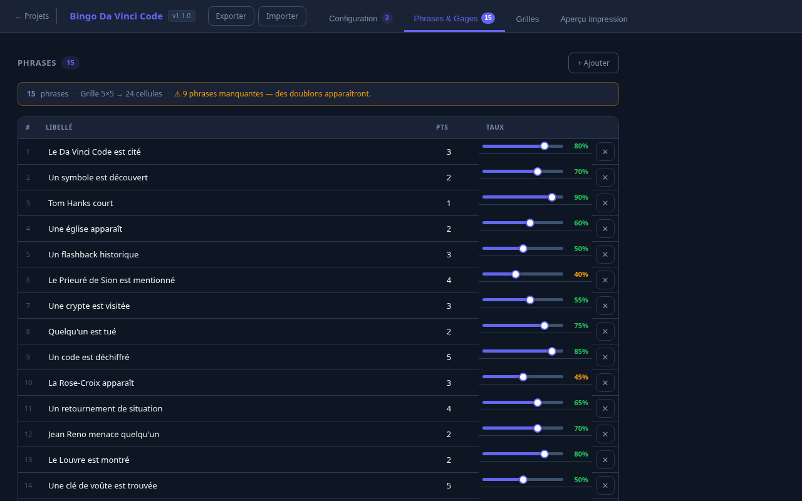
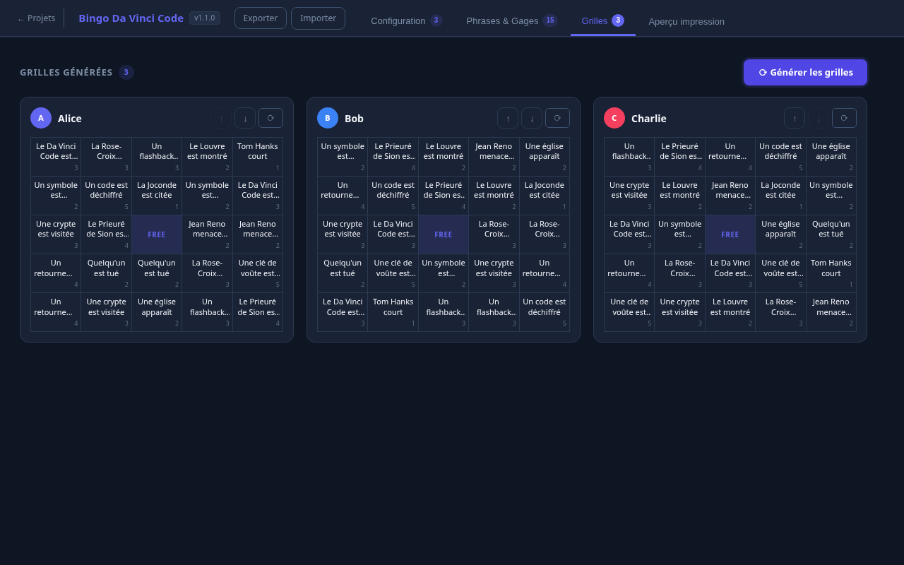
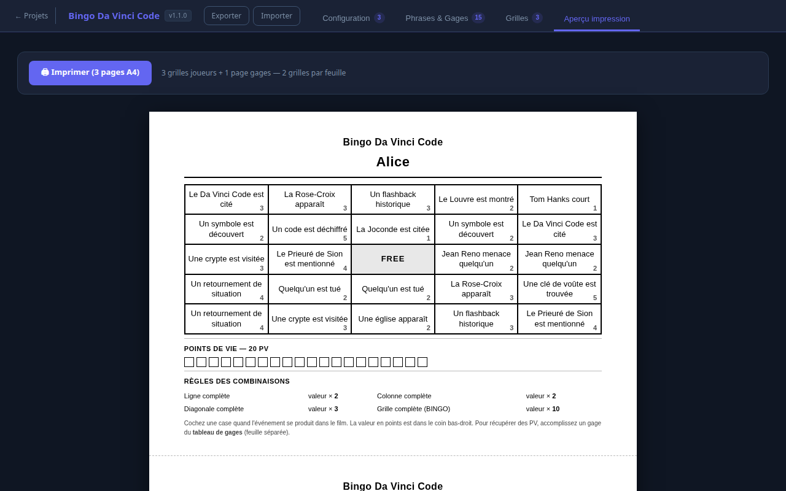
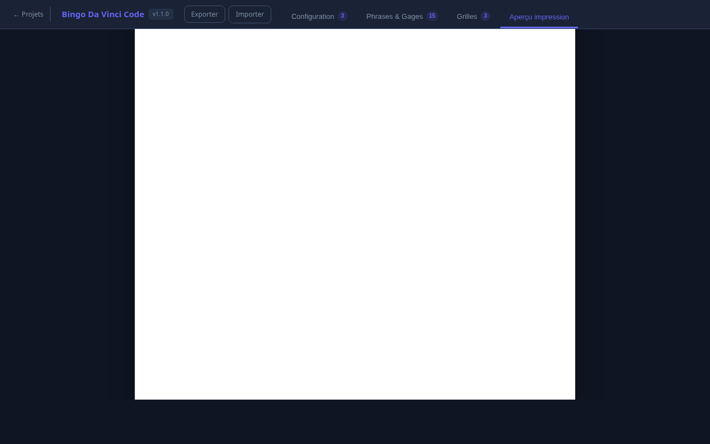

# Open Bingo

Générateur de grilles de bingo personnalisables pour soirées jeux. Chaque joueur obtient une grille unique tirée aléatoirement depuis un pool de cases thématiques.

## Jouer en ligne (sans installation)

**[Ouvrir Open Bingo dans le navigateur →](https://poisson48.github.io/open_bingo/)**

Fonctionne directement dans Chrome, Firefox, Safari — aucune installation requise.

## Télécharger l'application

| Plateforme | Fichier | Notes |
|-----------|---------|-------|
| Linux | [`.AppImage`](https://github.com/Poisson48/open_bingo/releases/latest) | Toutes distros — `chmod +x` puis double-clic |
| Linux (Ubuntu/Debian) | [`.deb`](https://github.com/Poisson48/open_bingo/releases/latest) | `sudo dpkg -i fichier.deb` |
| Windows | [`.exe`](https://github.com/Poisson48/open_bingo/releases/latest) | Installeur NSIS |
| macOS | [`.dmg`](https://github.com/Poisson48/open_bingo/releases/latest) | Glisser dans Applications |
| Android | [`.apk`](https://github.com/Poisson48/open_bingo/releases/latest) | Activer "Sources inconnues" |

> Les données (projets) sont conservées entre les mises à jour — elles sont stockées dans le dossier utilisateur de l'app, indépendamment de la version installée.

## Aperçu











## Fonctionnalités

- **Gestion de plusieurs projets** — créez, clonez, modifiez et supprimez des bingos depuis la liste de projets
- **Recherche de projets** — barre de recherche sur le titre et la description
- **Export / Import natif** — dialog "Enregistrer sous…" sur PC, picker Android natif, `showSaveFilePicker` dans le navigateur
- **Grilles uniques par joueur** — chaque grille est générée indépendamment avec mélange aléatoire
- **Taux d'apparition par case** — slider 0–100 % pour contrôler la probabilité d'inclusion
- **Taille de grille configurable** — de 2×2 à 12×12
- **Case FREE centrale** — activable si la grille est de taille impaire
- **Système de points & multiplicateurs** — ligne, colonne, diagonale, grille complète
- **Mode Gage** — gameplay alternatif sans PV : le numéro de chaque case renvoie au gage correspondant à effectuer ; gages de combinaison (ligne / colonne / diagonale) configurables séparément
- **Gages** — liste de défis avec PV récupérés (mode classique) ou actions à effectuer (mode gage)
- **Drag & drop sur les grilles** — réorganisez les cases en glissant-déposant (fonctionne sur PC et Android)
- **Clic pour remplacer** — cliquez sur une case pour la remplacer par une autre phrase
- **Autosave** — toutes les modifications sont sauvegardées automatiquement
- **Aperçu impression A4** — grilles maximisées sur la demi-page + page dédiée au tableau des gages
- **Numéro de version** — affiché en haut à gauche, mis à jour automatiquement à chaque release
- **App desktop native** — via Tauri v2 (Linux, Windows, macOS, Android)

## Lancer en local (mode serveur)

```bash
cd bingo-app
npm install
npm start        # → http://localhost:3000
```

## Build desktop (Tauri)

```bash
npm install               # installe @tauri-apps/cli
npm run dev               # fenêtre native locale
```

Les builds **Linux**, **Windows**, **macOS** et **Android** sont produits automatiquement par GitHub Actions lors d'un push de tag :

```bash
git tag v1.1.1
git push origin v1.1.1   # déclenche le workflow → GitHub Releases
```

Prérequis locaux (Linux) : Rust, `libwebkit2gtk-4.1-dev`, `libgtk-3-dev`, `patchelf`.

## Modes de jeu

### Mode classique (défaut)
Chaque case a une valeur en points. Compléter une ligne / colonne / diagonale multiplie les points. Les gages permettent de récupérer des PV perdus.

### Mode Gage
Activé via la case à cocher dans Configuration. Les PV et multiplicateurs disparaissent. Le numéro affiché sur chaque case correspond au **numéro du gage** à effectuer quand l'événement se produit. Des **gages de combinaison** (ligne, colonne, diagonale) peuvent être configurés séparément pour les combos.

## Structure du projet

```
bingo-app/
  server.js           # Serveur Express (fichiers statiques uniquement)
  public/
    index.html
    version.json      # Version affichée dans l'app, patchée par le CI
    js/
      state.js        # État global, projets, autosave, export/import
      main.js         # Routage vues (projets / éditeur) + onglets
      projects.js     # Vue liste des projets
      config.js       # Onglet configuration
      cases.js        # Onglet phrases & gages
      generator.js    # Logique de génération des grilles
      grids.js        # Onglet affichage + drag & drop des grilles
      print.js        # Onglet aperçu impression
      ui.js           # Utilitaires (toast)
    style/
      main.css
      dashboard.css
      grid.css
      print.css
src-tauri/            # Tauri v2 — binaires natifs
.github/workflows/
  pages.yml           # Déploiement automatique sur GitHub Pages
  release.yml         # Build multi-plateforme sur tag git
screenshots/          # Captures d'écran pour le README
```

## Utilisation

1. **Projets** — créer ou ouvrir un projet depuis la liste d'accueil
2. **Configuration** — définir le titre, la taille de grille, les joueurs et le mode de jeu, puis cliquer *Enregistrer*
3. **Phrases & Gages** — ajouter les phrases (libellé, points/gage#, taux) et les gages
4. **Grilles** — générer les grilles ; les cases sont déplaçables par glisser-déposer ou remplaçables par clic
5. **Aperçu impression** — imprimer ou exporter en PDF (2 grilles par feuille A4)

## Tech

- Node.js + Express (serveur statique)
- Vanilla JS ES modules (aucun bundler, aucun framework)
- CSS natif
- Tauri v2 (desktop Linux / Windows / macOS + Android)
